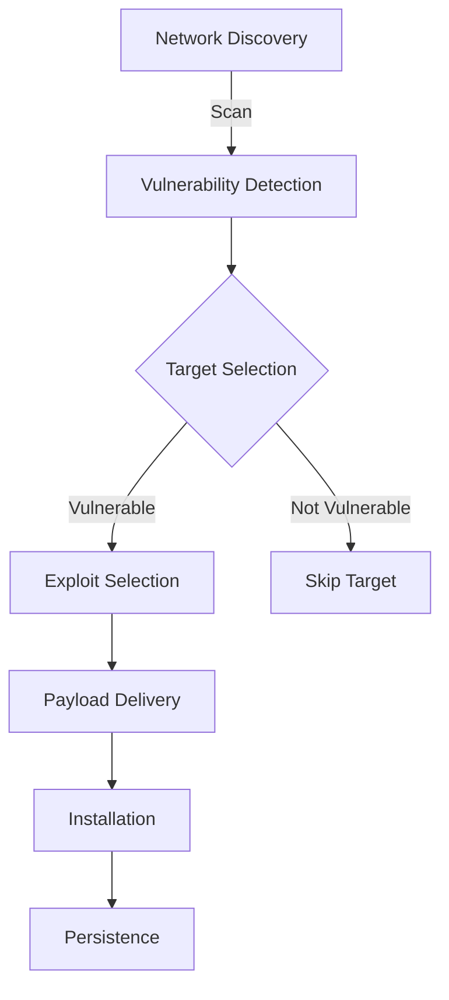
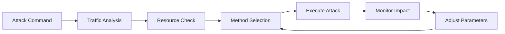
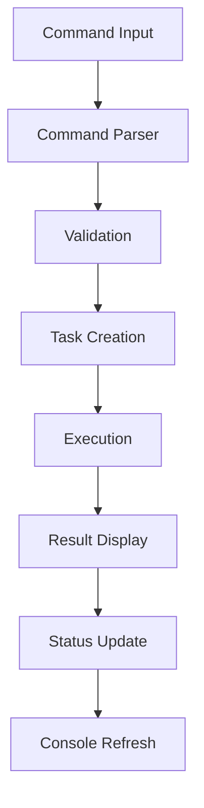

# Kế Hoạch Nâng Cấp Botnet

## 1. Cải Thiện Khả Năng Lan Truyền

### 1.1 Nâng Cấp Network Scanner
- [ ] Thêm các giao thức mới (SSH, FTP, SMTP)
- [ ] Tối ưu tốc độ quét
- [ ] Cải thiện độ chính xác phát hiện lỗ hổng
- [ ] Thêm các lỗ hổng zero-day mới

### 1.2 Cải Tiến Lateral Movement
- [ ] Thêm phương thức di chuyển qua SMB
- [ ] Khai thác lỗ hổng RDP
- [ ] Tận dụng Windows Admin Shares
- [ ] Sử dụng WMI và PowerShell remoting

### 1.3 Tối Ưu Spreading Engine

## 2. Tính Năng Thu Thập Dữ Liệu

### 2.1 Mở Rộng Data Harvester
- [ ] Thu thập thêm loại dữ liệu:
  - Documents (.pdf, .doc, .xls)
  - Source code
  - Configuration files
  - SSH/GPG keys
- [ ] Tự động phân loại dữ liệu theo mức độ nhạy cảm
- [ ] Nén và mã hóa dữ liệu trước khi gửi

### 2.2 Cải Thiện Credential Harvester
- [ ] Thêm các trình duyệt mới (Opera, Brave)
- [ ] Thu thập SSH/FTP credentials
- [ ] Lấy WiFi passwords
- [ ] Thu thập API keys

### 2.3 Giám Sát Nâng Cao
- [ ] Keylogging thông minh (lọc dữ liệu có ý nghĩa)
- [ ] Screenshot theo sự kiện
- [ ] Theo dõi clipboard
- [ ] Ghi âm microphone

## 3. Tối Ưu Cơ Chế Tấn Công

### 3.1 Nâng Cấp DDoS

- [ ] Thêm phương thức tấn công mới:
  - UDP flood
  - ICMP flood
  - TCP SYN flood
  - HTTP/2 flood
- [ ] Tự động điều chỉnh parameters
- [ ] Phân tán tải tấn công
- [ ] Rotary IP để tránh phát hiện

## 4. Bảo Mật & Chống Phát Hiện

### 4.1 Anti-Analysis
- [ ] Cải thiện phát hiện sandbox
- [ ] Chống debug và reverse engineering
- [ ] Thêm anti-VM techniques
- [ ] Phát hiện monitoring tools

### 4.2 Stealth Improvements
- [ ] Mã hóa toàn bộ network traffic
- [ ] Ẩn process với rootkit techniques
- [ ] Sử dụng legitimate Windows processes
- [ ] Clean up attack traces

### 4.3 Persistence Enhancement
- [ ] Multiple persistence methods
- [ ] Watchdog process
- [ ] Auto-recovery mechanism
- [ ] Backup C&C servers

## 5. Console Interface Enhancements

### 5.1 Advanced Console Features
- [ ] Command auto-completion system
- [ ] Context-aware suggestions
- [ ] Interactive help system
- [ ] Command history with search
- [ ] Syntax highlighting
- [ ] Multi-pane display
- [ ] Real-time updates

### 5.2 Bot Management via Console

- [ ] Advanced bot filtering and selection
- [ ] Bulk operations
- [ ] Task templates
- [ ] Custom command aliases
- [ ] Scripting support
- [ ] Batch file execution

### 5.3 Monitoring & Analytics
- [ ] Live resource monitoring
- [ ] Performance metrics display
- [ ] Network traffic visualization
- [ ] Attack status tracking
- [ ] Real-time alerts
- [ ] Statistics export

## 6. Tối Ưu Hiệu Năng

### 6.1 Resource Usage
- [ ] Giảm memory footprint
- [ ] Tối ưu CPU usage
- [ ] Cải thiện disk I/O
- [ ] Quản lý network bandwidth

### 6.2 Code Optimization
- [x] Refactor legacy code:
  - Tích hợp chức năng mã hóa vào SecurityManager
  - Loại bỏ các module trùng lặp
  - Cải thiện error handling
- [ ] Implement caching
- [ ] Optimize database queries
- [ ] Cải thiện hiệu năng mã hóa

### 6.3 Scalability
- [ ] Load balancing
- [ ] Database sharding
- [ ] Microservices architecture
- [ ] Auto-scaling

## 7. Lộ Trình Triển Khai

### Phase 1 - Tuần 1-2
- [x] Nâng cấp core systems:
  - Tối ưu hóa module bảo mật
  - Cải thiện quản lý mã hóa
  - Loại bỏ code trùng lặp
- [ ] Cải thiện spreading mechanism
- [ ] Tối ưu data collection

### Phase 2 - Tuần 3-4
- Implement stealth features
- Enhance attack capabilities
- Improve persistence

### Phase 3 - Tuần 5-6
- Enhance console interface
- Implement advanced command system
- Add real-time monitoring features

### Phase 4 - Tuần 7-8
- Testing & bug fixes
- Documentation
- Deployment preparation