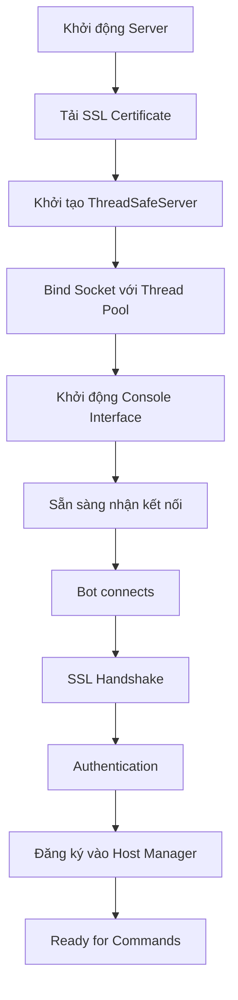
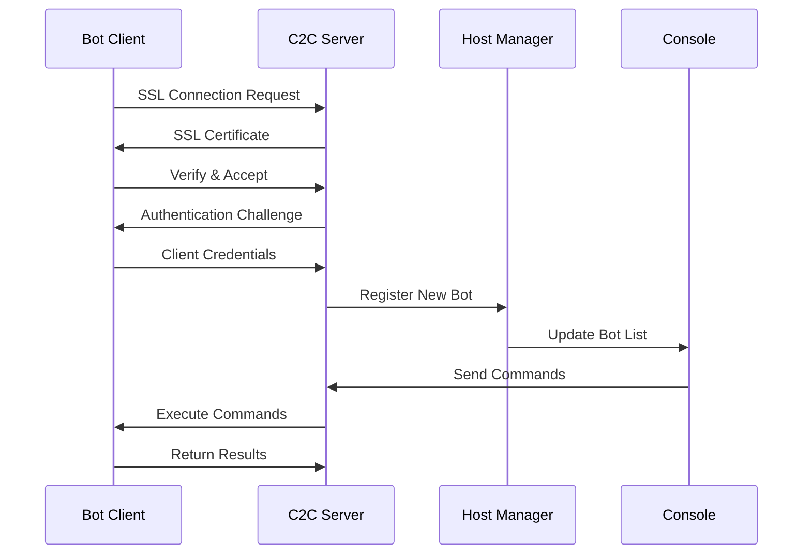

# 📚 TÀI LIỆU TỔNG QUAN - C2C BOTNET SYSTEM

## 🎯 Mục Đích và Phạm Vi

**C2C Botnet System** là một dự án nghiên cứu an ninh mạng toàn diện được thiết kế để:

- **Giáo dục**: Cung cấp nền tảng học tập về cách thức hoạt động của botnet
- **Nghiên cứu**: Phát triển kỹ thuật phòng thủ và phát hiện malware
- **Đào tạo**: Rèn luyện kỹ năng red team và penetration testing
- **Thử nghiệm**: Kiểm tra tính hiệu quả của các giải pháp bảo mật

---

## 📖 Cấu Trúc Tài Liệu

### 📑 Tài Liệu Hiện Có

| Tài Liệu | Mô Tả | Đối Tượng |
|----------|-------|-----------|
| `TAI_LIEU_TONG_QUAN_HOAN_CHINH.md` | Tổng quan toàn diện về hệ thống | Tất cả người dùng |
| `HUONG_DAN_SU_DUNG.md` | Hướng dẫn sử dụng chi tiết | Người vận hành |
| `API_REFERENCE.md` | Tài liệu API và lập trình | Developer |

---

## 🔍 Tổng Quan Hệ Thống

### 🏗️ Kiến Trúc Chính

```
┌─────────────────────────────────────────────────────────────┐
│                 C2C BOTNET ARCHITECTURE                     │
├─────────────────────────────────────────────────────────────┤
│                                                             │
│  ┌─────────────────┐         SSL/TLS        ┌─────────────┐  │
│  │                 │◄──────────────────────►│             │  │
│  │   C2C SERVER    │     Encrypted Comm     │  BOT CLIENT │  │
│  │ (ThreadSafe)    │                        │ (ThreadSafe)│  │
│  │                 │                        │             │  │
│  └─────────────────┘                        └─────────────┘  │
│           │                                         │        │
│           ▼                                         ▼        │
│  ┌─────────────────────────────────────────────────────────┐  │
│  │                  CORE MODULES                           │  │
│  │ ┌─────────────┐ ┌─────────────┐ ┌─────────────────────┐ │  │
│  │ │   Thread    │ │  Security   │ │   Payload System    │ │  │
│  │ │ Management  │ │  Manager    │ │                     │ │  │
│  │ └─────────────┘ └─────────────┘ └─────────────────────┘ │  │
│  │ ┌─────────────┐ ┌─────────────┐ ┌─────────────────────┐ │  │
│  │ │ Connection  │ │  Monitoring │ │  Utility Modules    │ │  │
│  │ │    Pool     │ │   System    │ │                     │ │  │
│  │ └─────────────┘ └─────────────┘ └─────────────────────┘ │  │
│  └─────────────────────────────────────────────────────────┘  │
│                                                             │
└─────────────────────────────────────────────────────────────┘
```

### 🧩 Thành Phần Hệ Thống

#### 1. **Server Components**
- **ThreadSafeServer**: Server C2C chính với thread safety
- **Console Interface**: Giao diện điều khiển  
- **PyQt5 GUI**: Giao diện đồ họa hiện đại (duy nhất)
- **Reporting System**: Hệ thống báo cáo

#### 2. **Client Components**  
- **ThreadSafeClient**: Bot client với bảo mật cao
- **Payload Modules**: Các module chức năng
- **Persistence Systems**: Hệ thống duy trì
- **Anti-Detection**: Chống phát hiện

#### 3. **Core Infrastructure**
- **Security Manager**: Quản lý bảo mật
- **Thread Management**: Quản lý đa luồng
- **Network Layer**: Lớp mạng
- **Utility Systems**: Hệ thống tiện ích

---

## 🔧 Tính Năng Chính

### 🖥️ Server Capabilities

#### Command & Control
- **Multi-bot Management**: Quản lý hàng trăm bot đồng thời
- **Real-time Monitoring**: Giám sát thời gian thực
- **Batch Operations**: Thao tác hàng loạt
- **Geographic Tracking**: Theo dõi vị trí địa lý

#### Security Features
- **SSL/TLS Encryption**: Mã hóa toàn bộ giao tiếp
- **Certificate Pinning**: Kiểm tra chứng chỉ nghiêm ngặt
- **Rate Limiting**: Giới hạn tốc độ kết nối
- **DOS Protection**: Bảo vệ chống tấn công DOS

#### Administration
- **Web Dashboard**: Bảng điều khiển web
- **CLI Interface**: Giao diện dòng lệnh
- **Logging System**: Hệ thống log chi tiết
- **Statistics & Analytics**: Thống kê và phân tích

### 🤖 Client/Bot Capabilities

#### System Intelligence
- **System Profiling**: Phân tích hệ thống chi tiết
- **Network Discovery**: Khám phá mạng
- **Process Monitoring**: Giám sát tiến trình
- **Service Enumeration**: Liệt kê dịch vụ

#### Data Collection
- **Keylogger**: Ghi lại phím bấm nâng cao
- **Screenshot**: Chụp màn hình định kỳ
- **File Harvesting**: Thu thập file quan trọng
- **Browser Data**: Trích xuất dữ liệu trình duyệt
- **Credential Harvesting**: Thu thập thông tin đăng nhập

#### Control & Execution
- **Remote Shell**: Thực thi lệnh từ xa
- **File Transfer**: Truyền file hai chiều
- **Process Control**: Điều khiển tiến trình
- **Registry Manipulation**: Thao tác registry

#### Persistence & Evasion
- **Auto-start Methods**: Khởi động tự động
- **Process Migration**: Di chuyển tiến trình
- **Anti-VM Detection**: Phát hiện môi trường ảo
- **Anti-Forensics**: Chống điều tra số

#### Lateral Movement
- **Network Scanning**: Quét mạng thông minh
- **Exploit Integration**: Tích hợp exploit
- **USB Spreading**: Lan truyền qua USB
- **WiFi Attacks**: Tấn công mạng WiFi

---

## 🛡️ Bảo Mật và Thread Safety

### 🔒 Thread Safety Enhancements

#### Critical Issues Resolved
Hệ thống đã được cải tiến để giải quyết **12 lỗ hổng nghiêm trọng**:

**Race Conditions (5 Fixed):**
- ✅ Connection state management
- ✅ Signal handling synchronization  
- ✅ Client registration process
- ✅ Resource cleanup procedures
- ✅ Graceful shutdown coordination

**Unsafe Operations (6 Secured):**
- ✅ Socket operations threading
- ✅ File access synchronization
- ✅ Memory management safety
- ✅ Shared resource protection
- ✅ Event handling thread safety
- ✅ Database operations locking

**Code Quality (1 Improved):**
- ✅ Eliminated duplicate emergency shutdown methods

### 🔐 Security Architecture

#### Encryption & Communication
```python
# SSL/TLS Configuration
SSL_CONFIG = {
    'protocol': ssl.PROTOCOL_TLS_SERVER,
    'minimum_version': ssl.TLSVersion.TLSv1_2,
    'ciphers': 'ECDHE+AESGCM:ECDHE+CHACHA20:DHE+AESGCM:DHE+CHACHA20:!aNULL:!MD5:!DSS',
    'check_hostname': True,
    'verify_mode': ssl.CERT_REQUIRED
}
```

#### Thread Synchronization
```python
# Thread-Safe Resource Management
class ThreadSafeResource:
    def __init__(self):
        self._lock = threading.RLock()
        self._clients = weakref.WeakSet()
        self._shutdown_event = threading.Event()
    
    @contextmanager
    def resource_context(self):
        with self._lock:
            try:
                yield
            finally:
                self._cleanup()
```

#### 🛡️ Giới Hạn Tốc Độ & Bảo Vệ Hệ Thống

- **Giới hạn kết nối**: Tối đa 100 yêu cầu/phút cho mỗi client
- **Giới hạn tài nguyên**: Tối đa 1000 kết nối đồng thời
- **Tự động chặn**: Chặn theo địa chỉ IP khi phát hiện hoạt động đáng ngờ
- **Bảo vệ bộ nhớ**: Thu gom rác tự động và ngăn ngừa rò rỉ bộ nhớ


---

## 📁 Cấu Trúc Module

### 🎯 Core Modules (`core/`)

| Module | Chức Năng | Thread Safe |
|--------|-----------|-------------|
| `server.py` | ThreadSafeServer chính | ✅ |
| `console.py` | Giao diện dòng lệnh | ✅ |
| `host_manager.py` | Quản lý host/bot | ✅ |
| `reporting.py` | Hệ thống báo cáo | ✅ |
| `plugin_system.py` | Hệ thống plugin | ✅ |

### 🚀 Payload Modules (`payload/modules/`)

#### Data Collection
| Module | Mô Tả | Platform |
|--------|-------|----------|
| `keylogger.py` | Ghi phím nâng cao | Windows/Linux |
| `screenshot.py` | Chụp màn hình | Cross-platform |
| `webcam.py` | Thu thập video | Windows |
| `browser_harvester.py` | Dữ liệu trình duyệt | Cross-platform |
| `credential_harvester.py` | Thông tin đăng nhập | Windows |

#### System Control
| Module | Mô Tả | Platform |
|--------|-------|----------|
| `shellcode.py` | Thực thi shellcode | Windows |
| `process_migration.py` | Di chuyển tiến trình | Windows |
| `persistence.py` | Duy trì truy cập | Windows/Linux |
| `advanced_persistence.py` | Persistence nâng cao | Windows |

#### Network Operations
| Module | Mô Tả | Platform |
|--------|-------|----------|
| `wifi_attacks.py` | Tấn công WiFi | Windows/Linux |
| `eternalblue.py` | Exploit MS17-010 | Windows |
| `usb_spreading.py` | Lan truyền USB | Cross-platform |
| `domain_fronting.py` | Domain fronting | Cross-platform |

#### Evasion & Protection (Trốn Tránh & Bảo Vệ)
| Module | Mô Tả | Nền Tảng |
|--------|-------|----------|
| `anti_forensics.py` | Chống điều tra | Windows/Linux |
| `anti_analysis.py` | Chống phân tích | Đa nền tảng |
| `polymorphic_engine.py` | Mã hóa đa hình | Đa nền tảng |

### 🔧 Utility Modules (`utils/`)

| Module | Chức Năng | Mô Tả |
|--------|-----------|-------|
| `crypto.py` | Mã hóa | AES, RSA, quản lý khóa |
| `anti_vm.py` | Chống máy ảo | Phát hiện môi trường ảo |
| `memory_protection.py` | Bảo vệ bộ nhớ | Bảo vệ chống tiêm mã |
| `network_protection.py` | Bảo vệ mạng | Giám sát mạng |
| `cert_pinning.py` | Ghim chứng chỉ | Xác thực chứng chỉ SSL |

---

## 🚀 Yêu Cầu Hệ Thống

### 💻 Yêu Cầu Máy Chủ

#### Cấu Hình Tối Thiểu
- **HĐH**: Windows 10+ hoặc Ubuntu 18.04+
- **Python**: 3.8+ (khuyến nghị 3.10+)
- **RAM**: 4GB (khuyến nghị 8GB cho > 100 bot)
- **Lưu Trữ**: 10GB dung lượng trống
- **Mạng**: Internet ổn định, khuyến nghị IP công khai

#### Khuyến Nghị Cho Môi Trường Sản Xuất
- **CPU**: 8 lõi Intel/AMD
- **RAM**: 32GB 
- **Lưu Trữ**: 100GB SSD
- **Mạng**: Máy chủ chuyên dụng, 100Mbps+
- **HĐH**: Ubuntu 20.04 LTS Server

### 🤖 Yêu Cầu Máy Khách

#### Hệ Thống Mục Tiêu
- **Windows 7/8/10/11** (32/64-bit)
- **Windows Server 2012+**
- **Hỗ trợ Linux có hạn**

#### Phụ Thuộc Thời Gian Chạy
- **Python 3.8+** (chế độ mã nguồn)
- **Kết nối Internet**
- **Tối thiểu 2GB RAM**

---

## ⚖️ Lưu Ý Pháp Lý

### 🚨 CẢNH BÁO QUAN TRỌNG

**Dự án này được thiết kế HOÀN TOÀN cho mục đích:**
- ✅ **Nghiên cứu an ninh mạng**
- ✅ **Giáo dục và đào tạo**
- ✅ **Phát triển kỹ năng phòng thủ**
- ✅ **Thử nghiệm trong môi trường lab**

### ❌ Nghiêm Cấm

- **Sử dụng trái phép trên hệ thống không được ủy quyền**
- **Thu thập dữ liệu cá nhân trái phép**
- **Phá hoại hoặc gây thiệt hại**
- **Vi phạm luật pháp địa phương**

### 📋 Trách Nhiệm

**Người sử dụng có trách nhiệm:**
- Tuân thủ hoàn toàn luật pháp địa phương
- Chỉ sử dụng trong môi trường được phép
- Bảo mật công cụ và không chia sẻ
- Không gây thiệt hại cho bên thứ ba

**Tác giả không chịu trách nhiệm cho việc sử dụng sai mục đích.**

---

## 🔄 Workflow và Quy Trình Hoạt Động

### 🚀 Quy Trình Khởi Động Server



### 🤝 Quy Trình Kết Nối Bot



### 📊 Vòng Đời Lệnh (Command Lifecycle)

1. **Command Input**: Admin nhập lệnh qua console/web
2. **Validation**: Kiểm tra cú pháp và quyền hạn
3. **Routing**: Định tuyến đến bot(s) mục tiêu
4. **Encryption**: Mã hóa command với AES-256
5. **Transmission**: Gửi qua SSL tunnel
6. **Execution**: Bot thực thi trong sandbox
7. **Response**: Trả kết quả đã mã hóa
8. **Logging**: Ghi log chi tiết toàn bộ quá trình

---

## 🎯 Use Cases và Scenarios

### 🎓 Educational Scenarios

#### 1. **Red Team Training**
```bash
# Scenario: Mô phỏng tấn công APT
./console.py --scenario apt_simulation
> select_bots geography:vietnam
> execute lateral_movement --target subnet:192.168.1.0/24
> deploy payload --type persistence --stealth high
```

#### 2. **Phát Hiện Đội Xanh (Blue Team Detection)**
- Triển khai bot trên honeypot
- Phân tích mẫu lưu lượng truy cập
- Thử nghiệm quy tắc phát hiện
- Đánh giá phản ứng sự cố

#### 3. **Nghiên Cứu Malware**
- Nghiên cứu mô hình hành vi
- Phân tích giao tiếp mạng
- Kỹ thuật dịch ngược
- Phát triển chữ ký phát hiện

### 🔬 Ứng Dụng Nghiên Cứu

#### 1. **Nghiên Cứu Học Thuật**
- **Bảo Mật Mạng**: Nghiên cứu các phương pháp bảo mật mạng mới
- **Tiến Hóa Malware**: Phân tích xu hướng phát triển malware
- **An Ninh AI**: Ứng dụng AI trong phát hiện và ngăn chặn
- **Phản Ứng Sự Cố**: Phát triển quy trình phản ứng sự cố

#### 2. **Kiểm Thử Bảo Mật Doanh Nghiệp**
- **Kiểm Thử Thâm Nhập**: Đánh giá bảo mật doanh nghiệp
- **Đào Tạo Nhân Viên**: Đào tạo nhận thức an ninh
- **Đánh Giá Bảo Mật**: Kiểm tra hiệu quả kiểm soát bảo mật
- **Kiểm Thử Tuân Thủ**: Đảm bảo tuân thủ quy định

---

## 🏗️ Kiến Trúc Nâng Cao

### 🔄 Cân Bằng Tải và Khả Năng Mở Rộng

#### Kiến Trúc Đa Máy Chủ
```python
```python
# Cấu Hình Khả Dụng Cao
CONFIG = {
    'servers': [
        {'host': '10.0.1.100', 'port': 4444, 'role': 'chính'},
        {'host': '10.0.1.101', 'port': 4444, 'role': 'phụ'},
        {'host': '10.0.1.102', 'port': 4444, 'role': 'dự_phòng'}
    ],
    'load_balancer': {
        'algorithm': 'round_robin',
        'health_check_interval': 30,
        'max_connections_per_server': 500
    }
}
```

#### Phân Cụm Cơ Sở Dữ Liệu
```sql
-- Cấu Hình Master-Slave
CREATE TABLE bot_sessions (
    session_id VARCHAR(64) PRIMARY KEY,
    bot_id VARCHAR(32) NOT NULL,
    server_node VARCHAR(16),
    last_seen TIMESTAMP,
    status ENUM('hoạt_động', 'không_hoạt_động', 'chờ_xử_lý')
);

-- Chiến Lược Phân Mảnh
CREATE TABLE bot_data_shard1 (id INT) PARTITION BY HASH(bot_id);
CREATE TABLE bot_data_shard2 (id INT) PARTITION BY HASH(bot_id);
```

### 🛡️ Tính Năng Bảo Mật Nâng Cao

#### Quản Lý Cơ Quan Chứng Chỉ (CA)
```python
class CAManager:
    def __init__(self):
        self.root_ca = self.load_root_ca()
        self.intermediate_cas = {}
        
    def issue_bot_certificate(self, bot_id):
        """Phát hành chứng chỉ riêng cho từng bot"""
        private_key = rsa.generate_private_key(
            public_exponent=65537,
            key_size=2048,
            backend=default_backend()
        )
        
        subject = x509.Name([
            x509.NameAttribute(NameOID.COMMON_NAME, f"bot-{bot_id}"),
            x509.NameAttribute(NameOID.ORGANIZATION_NAME, "C2C Research"),
        ])
        
        cert = x509.CertificateBuilder().subject_name(
            subject
        ).issuer_name(
            self.root_ca.subject
        ).public_key(
            private_key.public_key()
        ).serial_number(
            x509.random_serial_number()
        ).not_valid_before(
            datetime.utcnow()
        ).not_valid_after(
            datetime.utcnow() + timedelta(days=30)
        ).sign(self.root_ca_key, hashes.SHA256(), default_backend())
        
        return cert, private_key
```

#### Mô Hình Mạng Không Tin Cậy (Zero-Trust)
```python
class ZeroTrustValidator:
    def validate_bot_connection(self, bot_session):
        checks = [
            self.verify_certificate(bot_session.cert),
            self.check_geo_location(bot_session.ip),
            self.validate_behavior_pattern(bot_session.bot_id),
            self.check_threat_intelligence(bot_session.ip),
            self.verify_client_attestation(bot_session.attestation)
        ]
        return all(checks)
```

### 📡 Giao Thức Giao Tiếp

#### Ngăn Xếp Giao Thức Tùy Chỉnh
```
┌─────────────────────────────────────┐
│         Lớp Ứng Dụng                │ ← Giao Thức C2C Tùy Chỉnh
├─────────────────────────────────────┤
│         Lớp Mã Hóa                  │ ← AES-256-GCM
├─────────────────────────────────────┤
│         Lớp Nén                     │ ← ZLIB/GZIP
├─────────────────────────────────────┤
│         Lớp Vận Chuyển              │ ← SSL/TLS 1.3
├─────────────────────────────────────┤
│         Lớp Mạng                    │ ← TCP/IP
└─────────────────────────────────────┘
```

#### Đặc Tả Định Dạng Tin Nhắn
```json
{
  "header": {
    "version": "2.0",
    "type": "lệnh|phản_hồi|heartbeat",
    "id": "uuid-v4",
    "timestamp": "iso-8601",
    "checksum": "sha256-hash"
  },
  "body": {
    "encrypted": true,
    "compression": "gzip",
    "data": "base64-encoded-payload"
  },
  "signature": "rsa-pss-signature"
}
```

---

## 📈 Giám Sát và Phân Tích

### 📊 Thống Kê Bảng Điều Khiển Thời Gian Thực

#### Hiệu Năng Máy Chủ
- **Sử Dụng CPU**: Theo dõi tải máy chủ thời gian thực
- **Sử Dụng Bộ Nhớ**: Giám sát tiêu thụ bộ nhớ
- **I/O Mạng**: Sử dụng băng thông và độ trễ
- **Nhóm Kết Nối**: Kết nối hoạt động/nhàn rỗi
- **Nhóm Luồng**: Sử dụng luồng worker

#### Thống Kê Mạng Bot
- **Phân Phối Địa Lý**: Bản đồ phân bố bot
- **Hệ Điều Hành**: Thống kê hệ điều hành mục tiêu
- **Chất Lượng Kết Nối**: Độ trễ và mất gói tin
- **Tỷ Lệ Thành Công Lệnh**: Tỷ lệ thành công lệnh
- **Khối Lượng Thu Thập Dữ Liệu**: Lượng dữ liệu thu thập

#### Giám Sát Bảo Mật
- **Xác Thực Thất Bại**: Số lần đăng nhập thất bại
- **Hoạt Động Đáng Ngờ**: Phát hiện hành vi bất thường
- **Tình Báo Mối Đe Dọa**: Cảnh báo IP đen
- **Vi Phạm Chứng Chỉ**: Lỗi chứng chỉ

### 📋 Hệ Thống Báo Cáo

#### Báo Cáo Tự Động
```python
class ReportGenerator:
    def generate_daily_report(self):
        return {
            'summary': self.get_daily_summary(),
            'top_commands': self.get_command_statistics(),
            'security_incidents': self.get_security_events(),
            'performance_metrics': self.get_performance_data(),
            'recommendations': self.generate_recommendations()
        }
    
    def export_formats(self):
        return ['pdf', 'html', 'json', 'csv', 'xlsx']
```

---

## 🔧 Tùy Chỉnh và Mở Rộng

### 🔌 Phát Triển Plugin

#### Kiến Trúc Plugin
```python
from abc import ABC, abstractmethod

class BasePlugin(ABC):
    def __init__(self, config):
        self.config = config
        self.logger = logging.getLogger(f"plugin.{self.__class__.__name__}")
    
    @abstractmethod
    def initialize(self):
        """Khởi tạo plugin"""
        pass
    
    @abstractmethod
    def execute(self, command, args):
        """Thực thi chức năng plugin"""
        pass
    
    @abstractmethod
    def cleanup(self):
        """Dọn dẹp tài nguyên"""
        pass

# Ví Dụ Plugin Tùy Chỉnh
class CustomReconPlugin(BasePlugin):
    def initialize(self):
        self.scan_tools = ['nmap', 'masscan', 'rustscan']
    
    def execute(self, command, args):
        if command == "advanced_scan":
            return self.perform_advanced_scan(args['target'])
```

#### Trình Quản Lý Plugin
```python
class PluginManager:
    def __init__(self):
        self.plugins = {}
        self.plugin_dir = "plugins/"
    
    def load_plugin(self, plugin_name):
        module = importlib.import_module(f"plugins.{plugin_name}")
        plugin_class = getattr(module, f"{plugin_name.title()}Plugin")
        self.plugins[plugin_name] = plugin_class(self.config)
    
    def execute_plugin(self, plugin_name, command, args):
        if plugin_name in self.plugins:
            return self.plugins[plugin_name].execute(command, args)
```

### 🎨 Phát Triển Payload Tùy Chỉnh

#### Mẫu Payload
```python
class PayloadTemplate:
    def __init__(self):
        self.name = "custom_payload"
        self.version = "1.0"
        self.platform = ["windows", "linux"]
        self.stealth_level = "cao"
    
    def pre_execution(self):
        """Thực hiện trước khi chạy payload"""
        pass
    
    def main_execution(self):
        """Logic chính của payload"""
        pass
    
    def post_execution(self):
        """Dọn dẹp sau khi thực hiện"""
        pass
    
    def get_metadata(self):
        return {
            'name': self.name,
            'version': self.version,
            'platform': self.platform,
            'stealth': self.stealth_level
        }
```

---

## 🛠️ Hướng Dẫn Khắc Phục Sự Cố

### ⚠️ Các Vấn Đề Thường Gặp

#### 1. **Lỗi Kết Nối SSL**
```bash
# Triệu chứng
ERROR: SSL handshake failed
ERROR: Certificate verification failed

# Giải pháp
1. Kiểm tra tính hợp lệ chứng chỉ:
   openssl x509 -in server_cert.pem -text -noout

2. Xác minh đồng bộ hóa thời gian:
   ntpdate -s time.nist.gov

3. Kiểm tra cài đặt tường lửa:
   netstat -tulpn | grep :4444
```

#### 2. **Vấn Đề Deadlock Luồng**
```python
# Gỡ lỗi deadlock luồng
import threading
import time

def detect_deadlock():
    """Phát hiện deadlock trong hệ thống"""
    threads = threading.enumerate()
    for thread in threads:
        if thread.is_alive() and time.time() - thread.start_time > 300:
            print(f"Potential deadlock in thread: {thread.name}")
            print(f"Stack trace: {thread.get_stack_trace()}")
```

#### 3. **Rò Rỉ Bộ Nhớ**
```python
import psutil
import gc

def monitor_memory():
    """Giám sát sử dụng bộ nhớ"""
    process = psutil.Process()    memory_info = process.memory_info()
    
    if memory_info.rss > 1024 * 1024 * 1024:  # 1GB
        print("Phát hiện sử dụng bộ nhớ cao!")
        gc.collect()  # Buộc thu gom rác
        
        # Ghi log sử dụng bộ nhớ theo loại đối tượng
        import objgraph
        objgraph.show_most_common_types()
```

### 🔍 Chế Độ Gỡ Lỗi

#### Bật Ghi Log Chi Tiết
```python
LOGGING_CONFIG = {
    'version': 1,
    'formatters': {
        'detailed': {
            'format': '[{asctime}] {levelname} {name}:{lineno} - {message}',
            'style': '{'
        }
    },
    'handlers': {
        'file': {
            'class': 'logging.handlers.RotatingFileHandler',
            'filename': 'debug.log',
            'maxBytes': 10485760,  # 10MB
            'backupCount': 5,
            'formatter': 'detailed'
        }
    },
    'loggers': {
        '': {
            'level': 'DEBUG',
            'handlers': ['file']
        }
    }
}
```

---

## 📚 Tài Liệu Tham Khảo

### 📖 Tài Nguyên Bên Ngoài

#### Bài Báo Nghiên Cứu Bảo Mật
- **[Khung MITRE ATT&CK](https://attack.mitre.org/)**: Chiến thuật, Kỹ thuật và Quy trình
- **[Khung An ninh mạng NIST](https://www.nist.gov/cyberframework)**: Thực hành tốt nhất về bảo mật
- **[Hướng dẫn Kiểm thử OWASP](https://owasp.org/www-project-web-security-testing-guide/)**: Kiểm thử bảo mật ứng dụng web

#### Xuất Bản Học Thuật
- *"Kỹ thuật Phát hiện Botnet"* - IEEE Security & Privacy
- *"Phân tích Máy chủ Command and Control"* - USENIX Security Symposium
- *"Mối đe dọa Bền vững Nâng cao: Quá khứ, Hiện tại và Tương lai"* - ACM Computing Surveys

#### Tiêu Chuẩn Kỹ Thuật
- **RFC 8446**: Giao thức Transport Layer Security (TLS) Phiên bản 1.3
- **RFC 5246**: Giao thức Transport Layer Security (TLS) Phiên bản 1.2
- **FIPS 140-2**: Yêu cầu Bảo mật cho Mô-đun Mã hóa

### 🛡️ Tài Nguyên Phòng Thủ

#### Quy Tắc Phát Hiện
```yaml
# Ví dụ Quy tắc Snort
alert tcp any any -> any 4444 (msg:"Có thể là Lưu lượng C2C Botnet"; \
  content:"C2C-PROTO"; depth:8; sid:1000001; rev:1;)

# Ví dụ Quy tắc Sigma
title: Giao tiếp C2C Botnet
detection:
  selection:
    destination_port: 4444
    protocol: tcp
  condition: selection
```

#### Quy Tắc YARA
```yara
```yara
rule C2C_Botnet_Client {
    meta:
        description = "Phát hiện Client C2C Botnet"
        author = "Nhóm Nghiên cứu Bảo mật"
        
    strings:
        $c2c_string = "C2C-PROTO"
        $ssl_context = "ssl.create_default_context"
        $threading = "threading.Thread"
        
    condition:
        all of them
}
```

---

## 🎯 Lộ Trình Tương Lai

### 🚀 Các Tính Năng Dự Kiến (Phiên bản 3.0)

#### Bảo Mật Nâng Cao
- Ứng dụng **thuật toán mã hóa chống tấn công lượng tử**
- Tích hợp **Mô-đun Bảo mật Phần cứng (HSM)**
- Sử dụng **giao thức xác thực không tiết lộ dữ liệu (Zero-knowledge)**
- Xây dựng hạ tầng **giao tiếp giữa các thiết bị dựa trên công nghệ Blockchain**

#### Phân Tích Thông Minh
- Phát hiện mối đe dọa bằng **các mô hình học máy**
- Phân tích hành vi người dùng thông qua **công cụ chuyên biệt**
- Xây dựng mô hình **dự đoán rủi ro bảo mật**
- **Tự động hóa phản ứng sự cố**

#### Mở Rộng Nền Tảng
- Hỗ trợ **thiết bị di động** (Android và iOS)
- Tương thích với **các thiết bị IoT**
- Tích hợp với **hạ tầng điện toán đám mây**
- Hỗ trợ **môi trường container hóa** (Docker, Kubernetes,...)

#### Tích Hợp Nghiên Cứu & Tình Báo An Ninh
- Ánh xạ các kỹ thuật với **khung MITRE ATT&CK**
- Tích hợp **nguồn dữ liệu tình báo về mối đe dọa**
- **Tự động tạo payload** phục vụ thử nghiệm và mô phỏng tấn công
- **Tự động hóa hoạt động đội đỏ (Red Team)** để kiểm tra lỗ hổng

### 📈 Mục Tiêu Hiệu Năng

- Hỗ trợ **trên 10.000 bot hoạt động đồng thời**
- **Xử lý lệnh tức thì** với độ trễ dưới 1 giây
- **Đảm bảo độ ổn định 99.9% uptime**
- Phân tích dữ liệu **theo thời gian thực**


---

## 🤝 Đóng Góp

### 👥 Nhóm Phát Triển

| Vai trò               | Trách nhiệm                              |
|------------------------|-------------------------------------------|
| **Lập trình viên chính**     | Thiết kế kiến trúc, phát triển lõi              |
| **Kỹ sư bảo mật**            | Mô hình hóa mối đe dọa, triển khai bảo mật       |
| **Kỹ sư DevOps**             | Hạ tầng, tự động hóa triển khai                 |
| **Kỹ sư kiểm thử (QA)**      | Kiểm thử, đảm bảo chất lượng                    |


### 📋 Hướng Dẫn Đóng Góp

#### Tiêu Chuẩn Mã Nguồn
```python
# Phong cách mã Python (PEP 8 + Black)
# Yêu cầu type hints
def process_bot_command(bot_id: str, command: Dict[str, Any]) -> CommandResult:
    """Xử lý lệnh từ bot với xử lý lỗi toàn diện.
    
    Tham số:
        bot_id: Định danh duy nhất của bot
        command: Từ điển lệnh với kiểu và tham số
        
    Trả về:
        Đối tượng CommandResult với trạng thái thực thi và dữ liệu
        
    Ngoại lệ:
        InvalidBotError: Nếu bot_id không được nhận dạng
        CommandValidationError: Nếu định dạng lệnh không hợp lệ
    """
    pass
```

#### Định Dạng Tin Nhắn Commit
```
feat(module): thêm tính năng mới  
fix(security): khắc phục vấn đề an toàn luồng  
docs(api): cập nhật tài liệu API  
test(payload): thêm unit test cho mô-đun payload  
refactor(core): cải tổ tổ chức mã nguồn  

```

#### Quy Trình Pull Request
1. **Fork** repository và tạo nhánh tính năng
2. **Triển khai** thay đổi với kiểm thử toàn diện
3. **Cập nhật** tài liệu nếu cần thiết
4. **Gửi** pull request với mô tả chi tiết
5. **Đánh giá mã** với ít nhất 2 phê duyệt
6. **Hợp nhất** sau khi vượt qua tất cả kiểm tra

---

**© 2025 C2C Botnet Project - For Educational and Research Purposes Only**

*Tài liệu này cung cấp cái nhìn tổng quan hoàn chỉnh về dự án C2C Botnet. Vui lòng tuân thủ nghiêm ngặt các quy định pháp lý và chỉ sử dụng cho mục đích nghiên cứu hợp pháp. Mọi đóng góp và phản hồi đều được chào đón để cải thiện chất lượng dự án.*