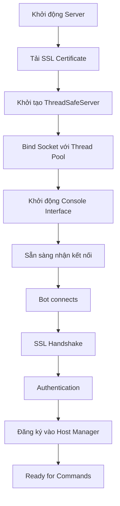
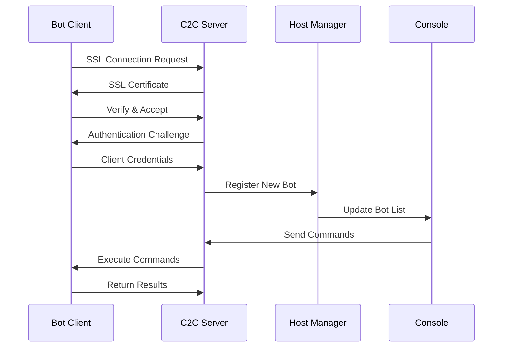

# 📚 TÀI LIỆU TỔNG QUAN - C2C BOTNET SYSTEM

## 🎯 Mục Đích và Phạm Vi

**C2C Botnet System** là một dự án nghiên cứu an ninh mạng toàn diện được thiết kế để:

- **Giáo dục**: Cung cấp nền tảng học tập về cách thức hoạt động của botnet
- **Nghiên cứu**: Phát triển kỹ thuật phòng thủ và phát hiện malware
- **Đào tạo**: Rèn luyện kỹ năng red team và penetration testing
- **Thử nghiệm**: Kiểm tra tính hiệu quả của các giải pháp bảo mật

---

## 📖 Cấu Trúc Tài Liệu

### 📑 Tài Liệu Hiện Có

| Tài Liệu | Mô Tả | Đối Tượng |
|----------|-------|-----------|
| `TAI_LIEU_TONG_QUAN_HOAN_CHINH.md` | Tổng quan toàn diện về hệ thống | Tất cả người dùng |
| `HUONG_DAN_CAI_DAT_CHI_TIET.md` | Hướng dẫn cài đặt từng bước | Người triển khai |
| `HUONG_DAN_SU_DUNG.md` | Hướng dẫn sử dụng chi tiết | Người vận hành |
| `API_REFERENCE.md` | Tài liệu API và lập trình | Developer |

---

## 🔍 Tổng Quan Hệ Thống

### 🏗️ Kiến Trúc Chính

```
┌─────────────────────────────────────────────────────────────┐
│                 C2C BOTNET ARCHITECTURE                     │
├─────────────────────────────────────────────────────────────┤
│                                                             │
│  ┌─────────────────┐         SSL/TLS        ┌─────────────┐  │
│  │                 │◄──────────────────────►│             │  │
│  │   C2C SERVER    │     Encrypted Comm     │  BOT CLIENT │  │
│  │ (ThreadSafe)    │                        │ (ThreadSafe)│  │
│  │                 │                        │             │  │
│  └─────────────────┘                        └─────────────┘  │
│           │                                         │        │
│           ▼                                         ▼        │
│  ┌─────────────────────────────────────────────────────────┐  │
│  │                  CORE MODULES                           │  │
│  │ ┌─────────────┐ ┌─────────────┐ ┌─────────────────────┐ │  │
│  │ │   Thread    │ │  Security   │ │   Payload System    │ │  │
│  │ │ Management  │ │  Manager    │ │                     │ │  │
│  │ └─────────────┘ └─────────────┘ └─────────────────────┘ │  │
│  │ ┌─────────────┐ ┌─────────────┐ ┌─────────────────────┐ │  │
│  │ │ Connection  │ │  Monitoring │ │  Utility Modules    │ │  │
│  │ │    Pool     │ │   System    │ │                     │ │  │
│  │ └─────────────┘ └─────────────┘ └─────────────────────┘ │  │
│  └─────────────────────────────────────────────────────────┘  │
│                                                             │
└─────────────────────────────────────────────────────────────┘
```

### 🧩 Thành Phần Hệ Thống

#### 1. **Server Components**
- **ThreadSafeServer**: Server C2C chính với thread safety
- **Console Interface**: Giao diện điều khiển
- **Web Interface**: Giao diện web quản lý
- **Reporting System**: Hệ thống báo cáo

#### 2. **Client Components**  
- **ThreadSafeClient**: Bot client với bảo mật cao
- **Payload Modules**: Các module chức năng
- **Persistence Systems**: Hệ thống duy trì
- **Anti-Detection**: Chống phát hiện

#### 3. **Core Infrastructure**
- **Security Manager**: Quản lý bảo mật
- **Thread Management**: Quản lý đa luồng
- **Network Layer**: Lớp mạng
- **Utility Systems**: Hệ thống tiện ích

---

## 🔧 Tính Năng Chính

### 🖥️ Server Capabilities

#### Command & Control
- **Multi-bot Management**: Quản lý hàng trăm bot đồng thời
- **Real-time Monitoring**: Giám sát thời gian thực
- **Batch Operations**: Thao tác hàng loạt
- **Geographic Tracking**: Theo dõi vị trí địa lý

#### Security Features
- **SSL/TLS Encryption**: Mã hóa toàn bộ giao tiếp
- **Certificate Pinning**: Kiểm tra chứng chỉ nghiêm ngặt
- **Rate Limiting**: Giới hạn tốc độ kết nối
- **DOS Protection**: Bảo vệ chống tấn công DOS

#### Administration
- **Web Dashboard**: Bảng điều khiển web
- **CLI Interface**: Giao diện dòng lệnh
- **Logging System**: Hệ thống log chi tiết
- **Statistics & Analytics**: Thống kê và phân tích

### 🤖 Client/Bot Capabilities

#### System Intelligence
- **System Profiling**: Phân tích hệ thống chi tiết
- **Network Discovery**: Khám phá mạng
- **Process Monitoring**: Giám sát tiến trình
- **Service Enumeration**: Liệt kê dịch vụ

#### Data Collection
- **Keylogger**: Ghi lại phím bấm nâng cao
- **Screenshot**: Chụp màn hình định kỳ
- **File Harvesting**: Thu thập file quan trọng
- **Browser Data**: Trích xuất dữ liệu trình duyệt
- **Credential Harvesting**: Thu thập thông tin đăng nhập

#### Control & Execution
- **Remote Shell**: Thực thi lệnh từ xa
- **File Transfer**: Truyền file hai chiều
- **Process Control**: Điều khiển tiến trình
- **Registry Manipulation**: Thao tác registry

#### Persistence & Evasion
- **Auto-start Methods**: Khởi động tự động
- **Process Migration**: Di chuyển tiến trình
- **Anti-VM Detection**: Phát hiện môi trường ảo
- **Anti-Forensics**: Chống điều tra số

#### Lateral Movement
- **Network Scanning**: Quét mạng thông minh
- **Exploit Integration**: Tích hợp exploit
- **USB Spreading**: Lan truyền qua USB
- **WiFi Attacks**: Tấn công mạng WiFi

---

## 🛡️ Bảo Mật và Thread Safety

### 🔒 Thread Safety Enhancements

#### Critical Issues Resolved
Hệ thống đã được cải tiến để giải quyết **12 lỗ hổng nghiêm trọng**:

**Race Conditions (5 Fixed):**
- ✅ Connection state management
- ✅ Signal handling synchronization  
- ✅ Client registration process
- ✅ Resource cleanup procedures
- ✅ Graceful shutdown coordination

**Unsafe Operations (6 Secured):**
- ✅ Socket operations threading
- ✅ File access synchronization
- ✅ Memory management safety
- ✅ Shared resource protection
- ✅ Event handling thread safety
- ✅ Database operations locking

**Code Quality (1 Improved):**
- ✅ Eliminated duplicate emergency shutdown methods

### 🔐 Security Architecture

#### Encryption & Communication
```python
# SSL/TLS Configuration
SSL_CONFIG = {
    'protocol': ssl.PROTOCOL_TLS_SERVER,
    'minimum_version': ssl.TLSVersion.TLSv1_2,
    'ciphers': 'ECDHE+AESGCM:ECDHE+CHACHA20:DHE+AESGCM:DHE+CHACHA20:!aNULL:!MD5:!DSS',
    'check_hostname': True,
    'verify_mode': ssl.CERT_REQUIRED
}
```

#### Thread Synchronization
```python
# Thread-Safe Resource Management
class ThreadSafeResource:
    def __init__(self):
        self._lock = threading.RLock()
        self._clients = weakref.WeakSet()
        self._shutdown_event = threading.Event()
    
    @contextmanager
    def resource_context(self):
        with self._lock:
            try:
                yield
            finally:
                self._cleanup()
```

#### Rate Limiting & Protection
- **Connection Throttling**: 100 requests/minute per client
- **Resource Limits**: Maximum 1000 concurrent connections
- **Automatic Blocking**: IP-based blocking for suspicious activity
- **Memory Protection**: Automatic garbage collection and leak prevention

---

## 📁 Cấu Trúc Module

### 🎯 Core Modules (`core/`)

| Module | Chức Năng | Thread Safe |
|--------|-----------|-------------|
| `server.py` | ThreadSafeServer chính | ✅ |
| `console.py` | Giao diện dòng lệnh | ✅ |
| `host_manager.py` | Quản lý host/bot | ✅ |
| `reporting.py` | Hệ thống báo cáo | ✅ |
| `plugin_system.py` | Hệ thống plugin | ✅ |

### 🚀 Payload Modules (`payload/modules/`)

#### Data Collection
| Module | Mô Tả | Platform |
|--------|-------|----------|
| `keylogger.py` | Ghi phím nâng cao | Windows/Linux |
| `screenshot.py` | Chụp màn hình | Cross-platform |
| `webcam.py` | Thu thập video | Windows |
| `browser_harvester.py` | Dữ liệu trình duyệt | Cross-platform |
| `credential_harvester.py` | Thông tin đăng nhập | Windows |

#### System Control
| Module | Mô Tả | Platform |
|--------|-------|----------|
| `shellcode.py` | Thực thi shellcode | Windows |
| `process_migration.py` | Di chuyển tiến trình | Windows |
| `persistence.py` | Duy trì truy cập | Windows/Linux |
| `advanced_persistence.py` | Persistence nâng cao | Windows |

#### Network Operations
| Module | Mô Tả | Platform |
|--------|-------|----------|
| `wifi_attacks.py` | Tấn công WiFi | Windows/Linux |
| `eternalblue.py` | Exploit MS17-010 | Windows |
| `usb_spreading.py` | Lan truyền USB | Cross-platform |
| `domain_fronting.py` | Domain fronting | Cross-platform |

#### Evasion & Protection
| Module | Mô Tả | Platform |
|--------|-------|----------|
| `anti_forensics.py` | Chống điều tra | Windows/Linux |
| `anti_analysis.py` | Chống phân tích | Cross-platform |
| `polymorphic_engine.py` | Mã hóa đa hình | Cross-platform |

### 🔧 Utility Modules (`utils/`)

| Module | Chức Năng | Mô Tả |
|--------|-----------|-------|
| `crypto.py` | Mã hóa | AES, RSA, key management |
| `anti_vm.py` | Anti-VM | Phát hiện môi trường ảo |
| `memory_protection.py` | Bảo vệ bộ nhớ | Memory injection protection |
| `network_protection.py` | Bảo vệ mạng | Network monitoring |
| `cert_pinning.py` | Certificate pinning | SSL certificate validation |

---

## 🚀 Yêu Cầu Hệ Thống

### 💻 Server Requirements

#### Minimum Configuration
- **OS**: Windows 10+ hoặc Ubuntu 18.04+
- **Python**: 3.8+ (khuyến nghị 3.10+)
- **RAM**: 4GB (8GB khuyến nghị cho > 100 bots)
- **Storage**: 10GB free space
- **Network**: Stable internet, public IP khuyến nghị

#### Recommended Production
- **CPU**: 8 cores Intel/AMD
- **RAM**: 32GB 
- **Storage**: 100GB SSD
- **Network**: Dedicated server, 100Mbps+
- **OS**: Ubuntu 20.04 LTS Server

### 🤖 Client Requirements

#### Target Systems
- **Windows 7/8/10/11** (32/64-bit)
- **Windows Server 2012+**
- **Limited Linux support**

#### Runtime Dependencies
- **Python 3.8+** (source mode)
- **Internet connectivity**
- **2GB RAM minimum**

---

## ⚖️ Lưu Ý Pháp Lý

### 🚨 CẢNH BÁO QUAN TRỌNG

**Dự án này được thiết kế HOÀN TOÀN cho mục đích:**
- ✅ **Nghiên cứu an ninh mạng**
- ✅ **Giáo dục và đào tạo**
- ✅ **Phát triển kỹ năng phòng thủ**
- ✅ **Thử nghiệm trong môi trường lab**

### ❌ Nghiêm Cấm

- **Sử dụng trái phép trên hệ thống không được ủy quyền**
- **Thu thập dữ liệu cá nhân trái phép**
- **Phá hoại hoặc gây thiệt hại**
- **Vi phạm luật pháp địa phương**

### 📋 Trách Nhiệm

**Người sử dụng có trách nhiệm:**
- Tuân thủ hoàn toàn luật pháp địa phương
- Chỉ sử dụng trong môi trường được phép
- Bảo mật công cụ và không chia sẻ
- Không gây thiệt hại cho bên thứ ba

**Tác giả không chịu trách nhiệm cho việc sử dụng sai mục đích.**

---

## 🔄 Workflow và Quy Trình Hoạt Động

### 🚀 Quy Trình Khởi Động Server



### 🤝 Quy Trình Kết Nối Bot



### 📊 Vòng Đời Lệnh (Command Lifecycle)

1. **Command Input**: Admin nhập lệnh qua console/web
2. **Validation**: Kiểm tra cú pháp và quyền hạn
3. **Routing**: Định tuyến đến bot(s) mục tiêu
4. **Encryption**: Mã hóa command với AES-256
5. **Transmission**: Gửi qua SSL tunnel
6. **Execution**: Bot thực thi trong sandbox
7. **Response**: Trả kết quả đã mã hóa
8. **Logging**: Ghi log chi tiết toàn bộ quá trình

---

## 🎯 Use Cases và Scenarios

### 🎓 Educational Scenarios

#### 1. **Red Team Training**
```bash
# Scenario: Mô phỏng tấn công APT
./console.py --scenario apt_simulation
> select_bots geography:vietnam
> execute lateral_movement --target subnet:192.168.1.0/24
> deploy payload --type persistence --stealth high
```

#### 2. **Blue Team Detection**
- Triển khai bot trên honeypot
- Phân tích traffic patterns
- Thử nghiệm detection rules
- Đánh giá incident response

#### 3. **Malware Research**
- Nghiên cứu behavior patterns
- Phân tích network communications
- Reverse engineering techniques
- Development của detection signatures

### 🔬 Research Applications

#### 1. **Academic Research**
- **Network Security**: Nghiên cứu các phương pháp bảo mật mạng mới
- **Malware Evolution**: Phân tích xu hướng phát triển malware
- **AI Security**: Ứng dụng AI trong detection và prevention
- **Incident Response**: Phát triển quy trình phản ứng sự cố

#### 2. **Corporate Security Testing**
- **Penetration Testing**: Đánh giá bảo mật enterprise
- **Employee Training**: Đào tạo nhận thức an ninh
- **Security Assessment**: Kiểm tra hiệu quả security controls
- **Compliance Testing**: Đảm bảo tuân thủ quy định

---

## 🏗️ Kiến Trúc Nâng Cao

### 🔄 Load Balancing và Scalability

#### Multi-Server Architecture
```python
# High Availability Configuration
CONFIG = {
    'servers': [
        {'host': '10.0.1.100', 'port': 4444, 'role': 'primary'},
        {'host': '10.0.1.101', 'port': 4444, 'role': 'secondary'},
        {'host': '10.0.1.102', 'port': 4444, 'role': 'failover'}
    ],
    'load_balancer': {
        'algorithm': 'round_robin',
        'health_check_interval': 30,
        'max_connections_per_server': 500
    }
}
```

#### Database Clustering
```sql
-- Master-Slave Configuration
CREATE TABLE bot_sessions (
    session_id VARCHAR(64) PRIMARY KEY,
    bot_id VARCHAR(32) NOT NULL,
    server_node VARCHAR(16),
    last_seen TIMESTAMP,
    status ENUM('active', 'inactive', 'pending')
);

-- Sharding Strategy
CREATE TABLE bot_data_shard1 (id INT) PARTITION BY HASH(bot_id);
CREATE TABLE bot_data_shard2 (id INT) PARTITION BY HASH(bot_id);
```

### 🛡️ Advanced Security Features

#### Certificate Authority (CA) Management
```python
class CAManager:
    def __init__(self):
        self.root_ca = self.load_root_ca()
        self.intermediate_cas = {}
        
    def issue_bot_certificate(self, bot_id):
        """Phát hành chứng chỉ riêng cho từng bot"""
        private_key = rsa.generate_private_key(
            public_exponent=65537,
            key_size=2048,
            backend=default_backend()
        )
        
        subject = x509.Name([
            x509.NameAttribute(NameOID.COMMON_NAME, f"bot-{bot_id}"),
            x509.NameAttribute(NameOID.ORGANIZATION_NAME, "C2C Research"),
        ])
        
        cert = x509.CertificateBuilder().subject_name(
            subject
        ).issuer_name(
            self.root_ca.subject
        ).public_key(
            private_key.public_key()
        ).serial_number(
            x509.random_serial_number()
        ).not_valid_before(
            datetime.utcnow()
        ).not_valid_after(
            datetime.utcnow() + timedelta(days=30)
        ).sign(self.root_ca_key, hashes.SHA256(), default_backend())
        
        return cert, private_key
```

#### Zero-Trust Network Model
```python
class ZeroTrustValidator:
    def validate_bot_connection(self, bot_session):
        checks = [
            self.verify_certificate(bot_session.cert),
            self.check_geo_location(bot_session.ip),
            self.validate_behavior_pattern(bot_session.bot_id),
            self.check_threat_intelligence(bot_session.ip),
            self.verify_client_attestation(bot_session.attestation)
        ]
        return all(checks)
```

### 📡 Communication Protocols

#### Custom Protocol Stack
```
┌─────────────────────────────────────┐
│         Application Layer           │ ← Custom C2C Protocol
├─────────────────────────────────────┤
│         Encryption Layer            │ ← AES-256-GCM
├─────────────────────────────────────┤
│         Compression Layer           │ ← ZLIB/GZIP
├─────────────────────────────────────┤
│         Transport Layer             │ ← SSL/TLS 1.3
├─────────────────────────────────────┤
│         Network Layer               │ ← TCP/IP
└─────────────────────────────────────┘
```

#### Message Format Specification
```json
{
  "header": {
    "version": "2.0",
    "type": "command|response|heartbeat",
    "id": "uuid-v4",
    "timestamp": "iso-8601",
    "checksum": "sha256-hash"
  },
  "body": {
    "encrypted": true,
    "compression": "gzip",
    "data": "base64-encoded-payload"
  },
  "signature": "rsa-pss-signature"
}
```

---

## 📈 Monitoring và Analytics

### 📊 Real-time Dashboard Metrics

#### Server Performance
- **CPU Usage**: Theo dõi tải server realtime
- **Memory Usage**: Giám sát memory consumption
- **Network I/O**: Bandwidth usage và latency
- **Connection Pool**: Active/idle connections
- **Thread Pool**: Worker thread utilization

#### Bot Network Statistics
- **Geographic Distribution**: Bản đồ phân bố bot
- **Operating System**: Thống kê OS targets
- **Connection Quality**: Latency và packet loss
- **Command Success Rate**: Tỷ lệ thành công lệnh
- **Data Collection Volume**: Lượng data thu thập

#### Security Monitoring
- **Failed Authentication**: Số lần đăng nhập thất bại
- **Suspicious Activities**: Phát hiện hành vi bất thường
- **Threat Intelligence**: Cảnh báo IP đen
- **Certificate Violations**: Lỗi chứng chỉ

### 📋 Reporting System

#### Automated Reports
```python
class ReportGenerator:
    def generate_daily_report(self):
        return {
            'summary': self.get_daily_summary(),
            'top_commands': self.get_command_statistics(),
            'security_incidents': self.get_security_events(),
            'performance_metrics': self.get_performance_data(),
            'recommendations': self.generate_recommendations()
        }
    
    def export_formats(self):
        return ['pdf', 'html', 'json', 'csv', 'xlsx']
```

---

## 🔧 Customization và Extension

### 🔌 Plugin Development

#### Plugin Architecture
```python
from abc import ABC, abstractmethod

class BasePlugin(ABC):
    def __init__(self, config):
        self.config = config
        self.logger = logging.getLogger(f"plugin.{self.__class__.__name__}")
    
    @abstractmethod
    def initialize(self):
        """Khởi tạo plugin"""
        pass
    
    @abstractmethod
    def execute(self, command, args):
        """Thực thi chức năng plugin"""
        pass
    
    @abstractmethod
    def cleanup(self):
        """Dọn dẹp tài nguyên"""
        pass

# Example Custom Plugin
class CustomReconPlugin(BasePlugin):
    def initialize(self):
        self.scan_tools = ['nmap', 'masscan', 'rustscan']
    
    def execute(self, command, args):
        if command == "advanced_scan":
            return self.perform_advanced_scan(args['target'])
```

#### Plugin Manager
```python
class PluginManager:
    def __init__(self):
        self.plugins = {}
        self.plugin_dir = "plugins/"
    
    def load_plugin(self, plugin_name):
        module = importlib.import_module(f"plugins.{plugin_name}")
        plugin_class = getattr(module, f"{plugin_name.title()}Plugin")
        self.plugins[plugin_name] = plugin_class(self.config)
    
    def execute_plugin(self, plugin_name, command, args):
        if plugin_name in self.plugins:
            return self.plugins[plugin_name].execute(command, args)
```

### 🎨 Custom Payload Development

#### Payload Template
```python
class PayloadTemplate:
    def __init__(self):
        self.name = "custom_payload"
        self.version = "1.0"
        self.platform = ["windows", "linux"]
        self.stealth_level = "high"
    
    def pre_execution(self):
        """Thực hiện trước khi chạy payload"""
        pass
    
    def main_execution(self):
        """Logic chính của payload"""
        pass
    
    def post_execution(self):
        """Dọn dẹp sau khi thực hiện"""
        pass
    
    def get_metadata(self):
        return {
            'name': self.name,
            'version': self.version,
            'platform': self.platform,
            'stealth': self.stealth_level
        }
```

---

## 🛠️ Troubleshooting Guide

### ⚠️ Common Issues

#### 1. **SSL Connection Errors**
```bash
# Symptoms
ERROR: SSL handshake failed
ERROR: Certificate verification failed

# Solutions
1. Kiểm tra certificate validity:
   openssl x509 -in server_cert.pem -text -noout

2. Verify time synchronization:
   ntpdate -s time.nist.gov

3. Check firewall settings:
   netstat -tulpn | grep :4444
```

#### 2. **Thread Deadlock Issues**
```python
# Debug thread deadlocks
import threading
import time

def detect_deadlock():
    """Phát hiện deadlock trong system"""
    threads = threading.enumerate()
    for thread in threads:
        if thread.is_alive() and time.time() - thread.start_time > 300:
            print(f"Potential deadlock in thread: {thread.name}")
            print(f"Stack trace: {thread.get_stack_trace()}")
```

#### 3. **Memory Leaks**
```python
import psutil
import gc

def monitor_memory():
    """Giám sát memory usage"""
    process = psutil.Process()
    memory_info = process.memory_info()
    
    if memory_info.rss > 1024 * 1024 * 1024:  # 1GB
        print("High memory usage detected!")
        gc.collect()  # Force garbage collection
        
        # Log memory usage by object type
        import objgraph
        objgraph.show_most_common_types()
```

### 🔍 Debug Mode

#### Enable Verbose Logging
```python
LOGGING_CONFIG = {
    'version': 1,
    'formatters': {
        'detailed': {
            'format': '[{asctime}] {levelname} {name}:{lineno} - {message}',
            'style': '{'
        }
    },
    'handlers': {
        'file': {
            'class': 'logging.handlers.RotatingFileHandler',
            'filename': 'debug.log',
            'maxBytes': 10485760,  # 10MB
            'backupCount': 5,
            'formatter': 'detailed'
        }
    },
    'loggers': {
        '': {
            'level': 'DEBUG',
            'handlers': ['file']
        }
    }
}
```

---

## 📚 Tài Liệu Tham Khảo

### 📖 External Resources

#### Security Research Papers
- **[MITRE ATT&CK Framework](https://attack.mitre.org/)**: Tactics, Techniques, and Procedures
- **[NIST Cybersecurity Framework](https://www.nist.gov/cyberframework)**: Security best practices
- **[OWASP Testing Guide](https://owasp.org/www-project-web-security-testing-guide/)**: Web application security testing

#### Academic Publications
- *"Botnet Detection Techniques"* - IEEE Security & Privacy
- *"Command and Control Server Analysis"* - USENIX Security Symposium
- *"Advanced Persistent Threats: Past, Present and Future"* - ACM Computing Surveys

#### Technical Standards
- **RFC 8446**: The Transport Layer Security (TLS) Protocol Version 1.3
- **RFC 5246**: The Transport Layer Security (TLS) Protocol Version 1.2
- **FIPS 140-2**: Security Requirements for Cryptographic Modules

### 🛡️ Defensive Resources

#### Detection Rules
```yaml
# Snort Rule Example
alert tcp any any -> any 4444 (msg:"Possible C2C Botnet Traffic"; \
  content:"C2C-PROTO"; depth:8; sid:1000001; rev:1;)

# Sigma Rule Example
title: C2C Botnet Communication
detection:
  selection:
    destination_port: 4444
    protocol: tcp
  condition: selection
```

#### YARA Rules
```yara
rule C2C_Botnet_Client {
    meta:
        description = "Detects C2C Botnet Client"
        author = "Security Research Team"
        
    strings:
        $c2c_string = "C2C-PROTO"
        $ssl_context = "ssl.create_default_context"
        $threading = "threading.Thread"
        
    condition:
        all of them
}
```

---

## 🎯 Future Roadmap

### 🚀 Planned Features (v3.0)

#### Enhanced Security
- **Quantum-resistant cryptography** implementation
- **Hardware Security Module (HSM)** integration
- **Zero-knowledge authentication** protocols
- **Blockchain-based C2C infrastructure**

#### Advanced Analytics
- **Machine Learning** threat detection
- **Behavioral analysis** engine
- **Predictive security** modeling
- **Automated incident response**

#### Platform Expansion
- **Mobile targets** (Android/iOS)
- **IoT device** support
- **Cloud infrastructure** integration
- **Container** environments

#### Research Integration
- **MITRE ATT&CK** framework mapping
- **Cyber Threat Intelligence** feeds
- **Automated payload** generation
- **Red team automation**

### 📈 Performance Goals

- **10,000+ concurrent bots** support
- **Sub-second command** execution
- **99.9% uptime** reliability
- **Real-time analytics** processing

---

## 🤝 Contributing

### 👥 Development Team

| Role | Responsibilities |
|------|------------------|
| **Lead Developer** | Architecture design, core development |
| **Security Engineer** | Threat modeling, security implementation |
| **DevOps Engineer** | Infrastructure, deployment automation |
| **QA Engineer** | Testing, quality assurance |

### 📋 Contribution Guidelines

#### Code Standards
```python
# Python Code Style (PEP 8 + Black)
# Type hints required
def process_bot_command(bot_id: str, command: Dict[str, Any]) -> CommandResult:
    """Process command from bot with comprehensive error handling.
    
    Args:
        bot_id: Unique identifier for the bot
        command: Command dictionary with type and parameters
        
    Returns:
        CommandResult object with execution status and data
        
    Raises:
        InvalidBotError: If bot_id is not recognized
        CommandValidationError: If command format is invalid
    """
    pass
```

#### Commit Message Format
```
feat(module): add new functionality
fix(security): resolve thread safety issue  
docs(api): update API documentation
test(payload): add unit tests for payload module
refactor(core): improve code organization
```

#### Pull Request Process
1. **Fork** repository và tạo feature branch
2. **Implement** changes với comprehensive tests
3. **Update** documentation nếu cần thiết
4. **Submit** pull request với detailed description
5. **Code review** với ít nhất 2 approvals
6. **Merge** sau khi pass tất cả checks

---

**© 2025 C2C Botnet Project - For Educational and Research Purposes Only**

*Tài liệu này cung cấp cái nhìn tổng quan hoàn chỉnh về dự án C2C Botnet. Vui lòng tuân thủ nghiêm ngặt các quy định pháp lý và chỉ sử dụng cho mục đích nghiên cứu hợp pháp. Mọi đóng góp và phản hồi đều được chào đón để cải thiện chất lượng dự án.*